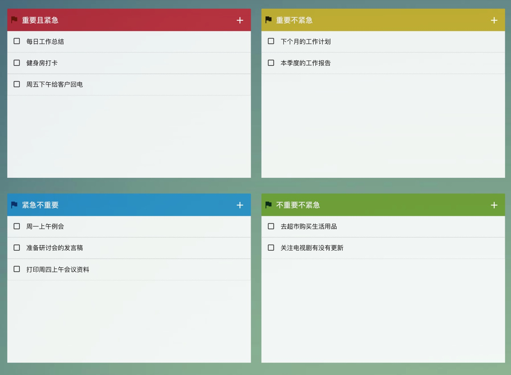
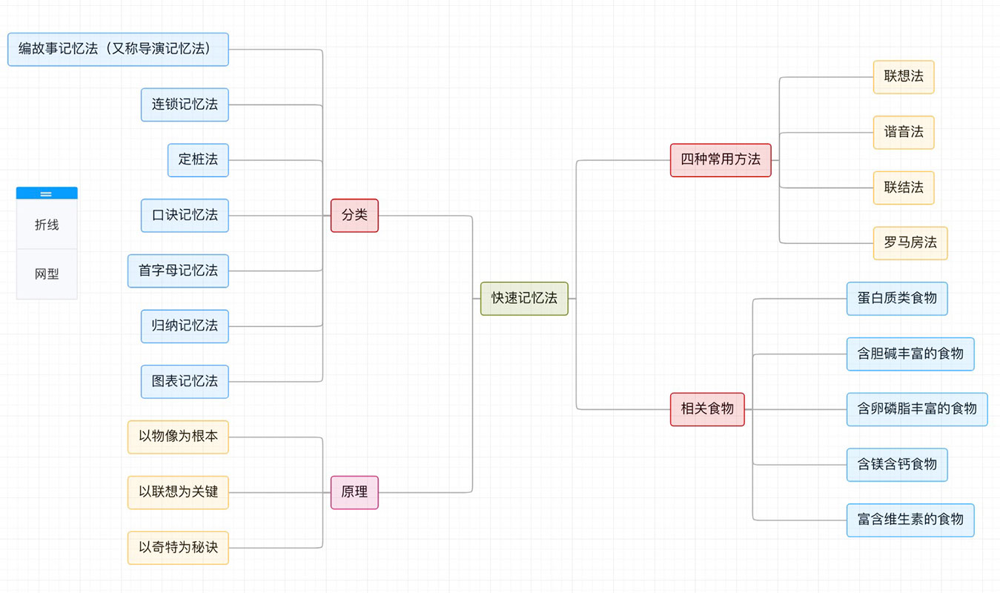
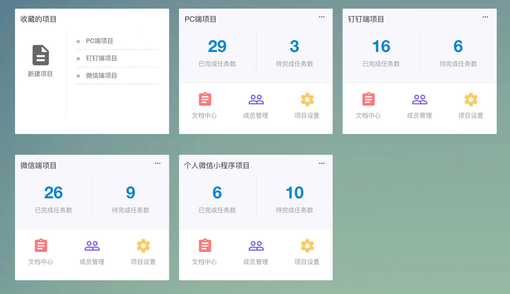
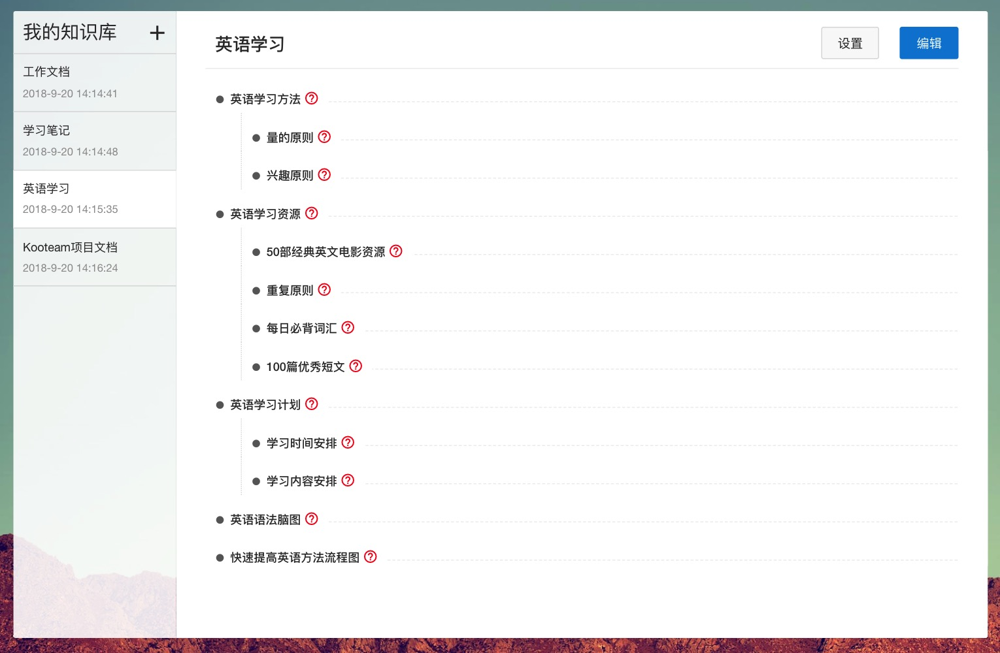

# 产品介绍

**[English Documentation](./README-EN.md)**

- `wookteam` 是一款轻量级的在线团队协作工具，提供各类文档工具、在线思维导图、在线流程图、项目管理、任务分发，知识库管理等工具。
- `wookteam` 支持团队在线聊天沟通，订阅任务动态实时推送。
- **`wookteam` 全部开源。**

## 官网地址

- [https://www.wookteam.com](https://www.wookteam.com)
- [安装教程](./INSTALL.md)

## 演示地址

- [https://demo.wookteam.com](https://demo.wookteam.com) (admin/123456)

## 微信咨询

- 

## 技术选型

- 后端框架：[Laravel7](https://laravel.com/) + LaravelS
- 前端框架：[Vue 2.0](https://cn.vuejs.org/) + Iview UI
- 数据库：Mysql
- 通讯框架：Swoole
- 主题样式：Kooteam

## 国际化

- `WookTeam`支持国际化，支持：简体中文、英文，英文译文来自谷歌翻译。如果你有更好的语法表达欢迎参与[译文编写](https://docs.google.com/spreadsheets/d/1m0de8-5vCwjKRwW_lsgzsi8wmOmQRl_bIMGN988Keak/edit?usp=sharing)

## 功能简介

**1. 待办四象限：突出事情优先级，帮助员工合理安排时间，提高工作效率**

**2. 在线流程图：在线流程图工具，使用方便**

**3. 在线思维导图：梳理思路，优化工作流程**

**4. 项目管理：自定义项目看板，可视化任务安排**

**5. 在线知识库：在线流程图，在线文档，以及可视化的目录编排，文档管理无忧**

